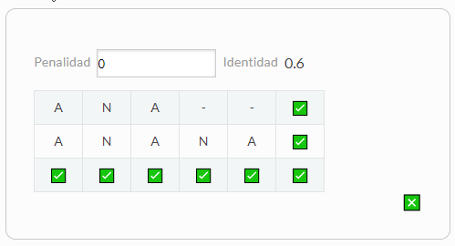

# Trabajo Practico #5
# Una palabra no dice nada y al mismo tiempo lo dice todo

## Integrantes

 - Esteban Cicovich
 - Nicolas Alvarez
 - Luis Coronel
 - Juan Hualumpa

## PARECIDO NO ES LO MISMO

### 👇 RETO I
```
Intentemos, entonces alinear estas dos palabras, para comprender mejor el problema.
Alineá en la tabla interactiva las palabras "BANANA" y "MANZANA".
¡Tomá nota de tus observaciones y de las conclusiones que se desprendan de estas observaciones!
```
#### ☑ PREGUNTAS DISPARADORAS
```
¿Existe una única forma de alinearlas?
¿Es alguno de los posibles alineamientos mejor que otro? Si así fuera ¿Por qué?
¿Qué representan esos guiones?
```

Podemos alinear las palabras de muchas forams diferentes, por ejemplo:


tendria una mayor similitud que otras combinaciones.
Los guiones en este caso van a representar el 'gap' que podiamos ver por ejemplo al usar la herramienta
Clustal Omega


### 👇 RETO II
```
En la siguiente tabla interactiva distintos alineamientos para las palabras "ANA" y "ANANA".
Verás que en el margen superior derecho aparece un valor de identidad calculado para cada alineamiento que intentes.
¡Tomá nota de los valores de identidad observados y de las
conclusiones que se desprendan de estas observaciones!
```
#### ☑ PREGUNTAS DISPARADORAS
```
¿Son todos los valores iguales?
¿Qué consideraciones deberían tenerse en cuenta a la hora de realizar el cálculo?
¿Se te ocurre, distintas formas de calcularlo?¿Serán todas ellas igualmente válidas en Biología?
```




Podemos ver que entre mas coincidencia tenga entre los dos alienamientos se incrementa el valor de identidad.
Deberiamos tener en cuenta la posicion de cada caracter teniendo en cuenta tambien los gaps

### 👇 RETO III
```
Probá en tabla interactiva distintos alineamientos para las palabras "ANA" y "ANANA". Verás que en el margen superior
derecho aparece un valor de identidad calculado para cada alineamiento que intentes y un botón para cambiar la penalidad que
se le otorga a dicho para el cálculo de identidad.
Probá varias combinaciones, tomá nota de los valores de identidad observados y de las conclusiones que se desprendan de
estas observaciones.
```
#### ☑ PREGUNTAS DISPARADORAS
```
¿Cómo se relacionan los valores de identidad obtenidos con las penalizaciones que se imponen al gap?
¿Qué implicancias crees que tiene una mayor penalización de gaps?
¿Se te ocurre alguna otra forma de penalización que no haya sido tenido en cuenta en este ejemplo?
```


El valor de penalidad se relaciona directamente con el de identidad ya que hace mas sensible el calculo de este ultimo. Esto podria ser util a la hora de buscar una identidad mas fuerte entre las secuencias alineadas. Una forma de penalizar podria ser considerando que los alineamientos se den con muchos gaps que formen letras solitaras.


### 👇 RETO IV
```
Probá en la tabla interactiva distintos alineamientos para las secuencias nucleotídicas.
Podrás ver las traducciones para cada secuencia.
Probá varias combinaciones, tomá nota de las observaciones y de las conclusiones que se desprendan de estas.
```
#### 👉 PARA PENSAR
```
¿Dá lo mismo si el gap que introducís cae en la primera, segunda o tercer posición del codón?
¿Cómo ponderarías las observaciones de este ejercicio para evaluar el parecido entre dos secuencias?
```

No, porque a pesar de no formar un aminoacido, el valor de identidad puede cambiar segun la coincidencia de los nucleotidos. Podrian considerarse los aminoacidos resultantes de cada secuencia en el calculo de identidad.


## TIPOS DE ALINEAMIENTOS

### 👇 RETO V
```
Estuvimos viendo que el alineamiento de secuencias no es trivial y requiere contemplar los múltiples caminos posibles, teniendo en cuenta al mismo tiempo la información biológica que restringe ese universo de posibilidades.
¡Es momento de llevar entonces estos conceptos a lo concreto! Te proponemos pensar los pasos a seguir en un alineamiento de dos secuencias cortas, teniendo en cuenta una matriz genérica de scoring (puntuación) que contemple las complejidades que estuvimos viendo, es decir que penalice de distinto modo una inserción o deleción, una discordancia (mismatch) o una coincidencia (match).
Escribilos o esquematizalos en un diagrama de flujo.
```
#### 👉 PARA PENSAR
```
¿En qué consiste la programación dinámica?
¿Por qué crees que es útil en este caso?
```

### 👇 RETO VI
```
Utilizando la herramienta interactiva desarrollada por el Grupo de Bioinformática de Freiburg probá distintos
Gap penalties para el ejemplo propuesto y observá lo que ocurre.
Interpretando la recursión, explicá con tus palabras de dónde salen los valores de la matriz que se construye.
¡Esquematiza tus conclusiones!
```

## BÚSQUEDA DE SIMILITUD SECUENCIAL

### 👇 RETO VII
```
Calculá el E-value y porcentaje de identidad utilizando el programa BLAST de la siguiente secuencia input
usando 20000 hits, un e-value de 100 y tomando aquellos hits con un mínimo de 70% cobertura.
Observe y discuta el comportamiento de : E-value vs. % id, Score vs % id, Score vs E-value
```

```
VVGGLGGYMLGSAMSRPIIHFGSDYEDRYYRENMHRYPNQVYYRPMDEYSNQNNFVHDCVNITIKQHTV
TTTTKGENFTETDVKMMERVVEQMCITQYERESQAYYQRGSSMVLFSSPPVILLISFLIFLIVG
```

### 👇 RETO VIII
```
Realizá nuevas búsquedas usando la mitad de la secuencia problema y para un cuarto de la secuencia original.
Compará los gráficos obtenidos. ¿Qué conclusiones puede sacas?
```

### 👇 RETO IX
```
Utilizando BLAST utilice búsquedas de similitud secuencial para identificar a la siguiente proteína:
```

```
MIDKSAFVHPTAIVEEGASIGANAHIGPFCIVGPHVEIGEGTVLKSHVVVNGHTKIGRDNEIYQFASIGEVNQ
DLKYAGEPTRVEIGDRNRIRESVTIHRGTVQGGGLTKVGSDNLLMINAHIAHDCTVGNRCILANNATLAGH
VSVDDFAIIGGMTAVHQFCIIGAHVMVGGCSGVAQDVPPYVIAQGNHATPFGVNIEGLKRRGFSREAITAIR
NAYKLIYRSGKTLDEVKPEIAELAETYPEVKAFTDFFARSTRGLIR
```

### 👇RETO X
```
Realizá una nueva corrida del BLASTp, utilizando la misma secuencia , pero ahora contra la base de datos PDB.
¿Se obtienen los mismo resultados?
¿Qué tipo de resultados(hits) se recuperan?
¿Cuándo nos podría ser útil este modo de corrida?
```