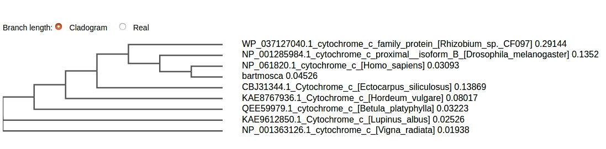

# TP 6

## Integrantes

 - Esteban Cicovich
 - Nicolas Alvarez
 - Luis Coronel
 - Juan Hualumpa

## Reto I
### Detalla las tácticas y/o metodologías que deberían utilizarse para darles una respuesta a lxs xadres del niño. 
- Dadas las secuencias de Mosca, humano y Moscahumano ¿Qué criterios se les
ocurren para comparar las secuencias? ¿Qué resultados obtienen del análisis
anterior?

Creo que habría que hacer un analisis de los alineamientos entre la proteina de mosca,huano, y moscahumano con el fin de obtener un arbol filogenetico y determinar a quien se parece mas. Creo que seria bueno analizarlo con Clustal.
- ¿Qué resultado esperaría obtener si utilizara el resto de las secuencias en el
análisis? ¿Por qué?

En cuanto mas secuencias se comparen, el resultado será mas preciso y se podrá ubicar a bart-mosca dentro de categorias mas especificas y mas cercanas a la realidad.

## RETO II:
Hicimos el alineamiento en Clustal, primero el del ej 1.

Como se puede notar en el arbol filogenético, no hay informacion relevante si solo se analizan los tres alineamientos

Luego en el ejercicio 2.

Se puede notar que bart,la mosca y el humano estan clusterizados en una rama y se diferencian ampliamente del resto de las especies. Esto confirma que bartmosca se parece mas a un humano que a una mosca! (Qué alivio...) :D

## RETO III:
### Mediante el uso del servidor de ​ IQtree ​ (Trifinopoulos et al. 2016)​, confecciona los árboles filogenéticos para los alineamientos obtenidos en el punto II.
- Como vemos, el servidor nos permite elegir el modelo de sustitución ¿A qué se
refiere?

Se refiere a los modelos que supone el proceso evolutivo, cual utilizar dependiendo de lo que se analiza, podria ser maxima parsimonia o maxima verosimilitud, por ejemplo.
- ¿Qué es el Bootstrap? ¿De qué manera nos habla de la calidad de nuestro árbol?
¿Cómo influye el número de Bootstraps en el resultado?

Bootstrap es una tecnica que una vez hecho un arbol filogenetico,cambia las columnas de los alineamientos de forma aleatoria para verificar que tan "fuerte" son las inferencias obtenidas. En cuanto mas veces se cambian las columnas, el resultado estadistico será mas preciso y garantizará una mejor inferencia.
- Interpreten los resultados obtenidos, mediante la visualización de los árboles con la
herramienta ​ FigTree​ . ¿Es necesario realizar algún paso extra, previo a la
interpretación del árbol? ¿Por qué? Podes instalarlo descargándolo desde:
http://tree.bio.ed.ac.uk/software/figtree/

Es necesario elegir la raiz del arbol para interpretarlo, esto va a depender de como se van a distribuir los nodos.
Si por ejemplo ponemos a bartmosca de nodo, podemos ver que las ramas a menos distancia,son las mas similares y podriamos a su vez, clasificarlas en plantas y humano-mosca.
